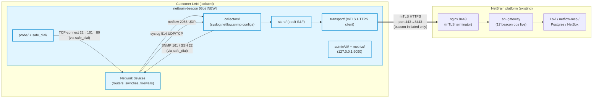
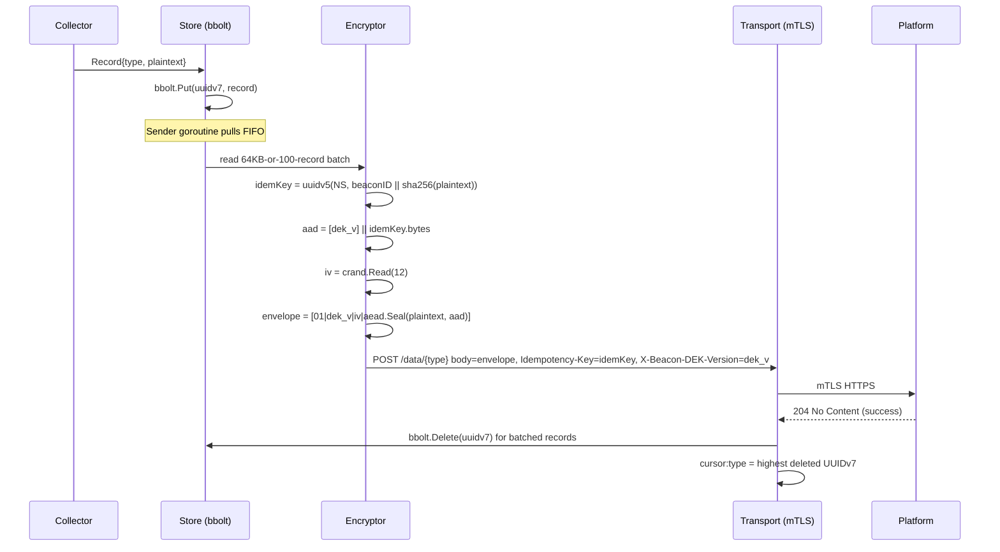
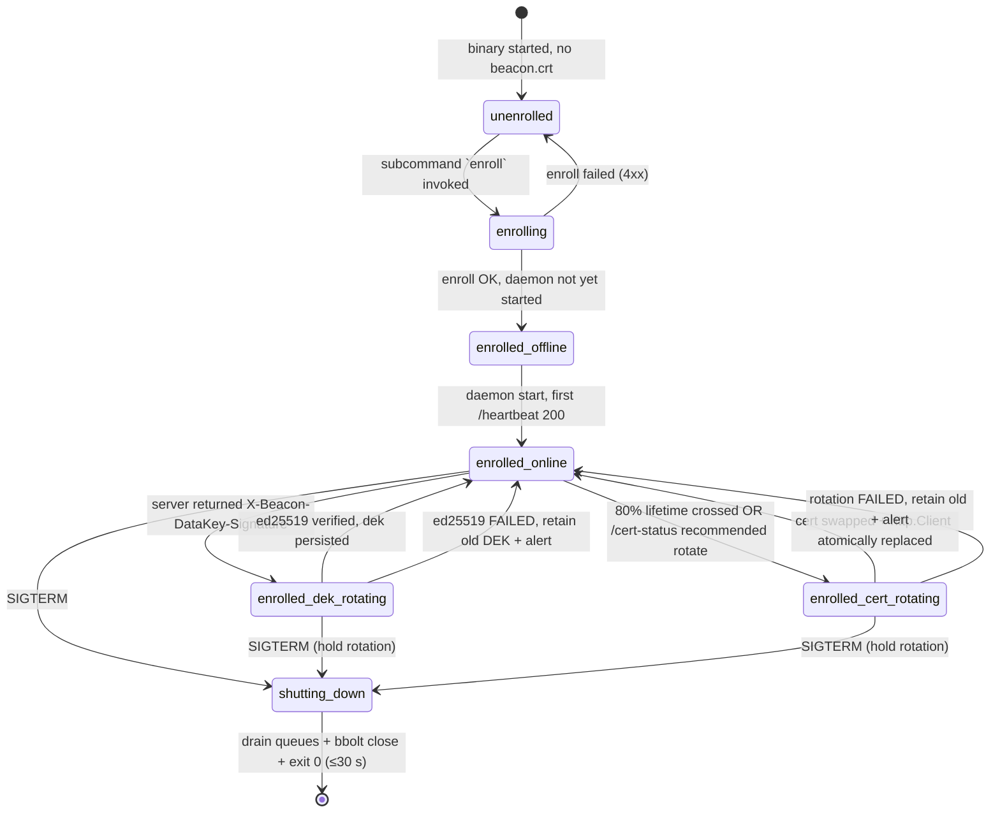

# Architecture: add-beacon-service

**Phase:** 3 (Design) | **Date:** 2026-05-10 | **Risk:** High
**Stack:** Go 1.26.3, distroless static-debian12:nonroot, GitHub Actions
**Locked decisions:** D-1..D-10 (see 00_STATUS.md §"Key Decisions added at /design-system")
**Companion ADRs:** ADR-077 (binary layout), ADR-078 (bbolt schema), ADR-079 (cert rotation atomicity), ADR-080 (cross-language fixtures), ADR-081 (safe_dial SSRF defense), ADR-082 (collector goroutine model)

This document is the architectural source of truth for `netbrain-beacon`, the customer-edge Go binary that completes the beacon ecosystem (parent contract: ADR-067..072 in the netbrain repo). The platform side (`add-multi-mode-ingestion`) shipped 2026-05-10 with 17 OpenAPI operations live behind feature flag. This issue ships the Go client that exercises 9 of those 17.

The beacon's job is small but unforgiving: collect logs/flows/SNMP/configs from devices on an isolated network, encrypt them with a per-install DEK, and ship them to the platform over mTLS. Single tenant per install. Stateless except for an on-disk buffer. No inbound HTTP. Cross-platform (Linux + Windows amd64). Static binary.

---

## 1. System Context Diagram



**Highlighted (light blue) = this issue's deliverables.** The platform side is consumer-only here; nothing in `netbrain` repo changes for this issue.

**Trust boundaries (top to bottom):**

1. **Devices ↔ beacon:** untrusted; beacon must validate SNMP responses, SSH host keys, parse syslog defensively. M-9 SSRF allow-list governs every beacon → device dial.
2. **Beacon ↔ platform:** mTLS-mutually-authenticated; platform CA pinned at enrollment, beacon cert pinned at enrollment, payloads additionally encrypted application-side.
3. **Beacon ↔ operator (local):** CLI subcommands run as the `netbrain` service user; metrics endpoint loopback-only.

**Cardinality:** one beacon process per customer install; one tenant per beacon (cert-bound); one tenant may run N beacons behind multi-proxy dedup (ADR-072) but each beacon is independent.

---

## 2. Component Design

The repo is laid out per ADR-077 — `cmd/` for the entrypoint, `internal/` for everything else, no `pkg/`.

```
netbrain-beacon/
├── cmd/netbrain-beacon/main.go        # subcommand dispatcher
├── internal/
│   ├── api/                            # generated by oapi-codegen v2 (DO NOT EDIT)
│   ├── enroll/                         # one-shot bootstrap-token-then-CSR ceremony
│   ├── crypto/
│   │   ├── dek_envelope.go             # AES-256-GCM wrap/unwrap
│   │   ├── idempotency.go              # UUIDv5 derivation
│   │   ├── platform_verify.go          # ed25519 signature verify (M-11)
│   │   └── streaming_gunzip.go         # byte-capped gunzip (M-6)
│   ├── transport/                      # mTLS HTTP client + cert auto-rotate
│   ├── config_poll/                    # 60s±10s loop, ETag, heartbeat
│   ├── collectors/
│   │   ├── syslog/                     # leodido/go-syslog v4 listener
│   │   ├── netflow/                    # goflow2 + pure-Go nfcapd writer
│   │   ├── snmp/                       # gosnmp poller
│   │   └── configs/                    # SSH config puller
│   ├── store/                          # bbolt S&F (5 GB / 14 d)
│   ├── probe/                          # TCP-connect device-latency
│   ├── safe_dial/                      # SSRF allow-list (M-9 chokepoint)
│   ├── admin/cli/                      # status / collectors / logs CLI
│   ├── metrics/                        # Prometheus registry
│   ├── clock/                          # injectable Clock interface
│   ├── log/                            # slog setup + redactor
│   └── version/                        # build stamps (filled by ldflags)
├── tests/fixtures/cross_lang/          # Python-generated, Go-consumed (ADR-080)
├── Dockerfile
├── Makefile
├── .golangci.yml
├── .github/workflows/ci.yml
├── packaging/{deb,rpm,arch,tarball,systemd}/   # D-4: all four from v1
└── go.mod
```

### 2.1 `cmd/netbrain-beacon/main.go`

**Responsibility:** parse top-level subcommand (`enroll | daemon | status | collectors | logs | version`), dispatch to the matching package's `Run(ctx, args, env) error`, return the exit code. Stdlib `flag` per ADR-077; no cobra.

**Key types:** none (thin entrypoint). Constructs root `context.Context` + signal handler (SIGTERM/SIGINT cancels root ctx).

**Depends on:** every `internal/...` Run() entrypoint via narrow function pointers.

**Reference:** ADR-077 §"CLI dispatch".

### 2.2 `internal/api/` (generated)

**Responsibility:** typed HTTP client + request/response models for all 17 OpenAPI operations. Beacon wires only the 9 it calls; the other 8 are unused but compile.

**Key types:** `Client`, `BeaconConfigResponse`, `BeaconEnrollRequest`, `BeaconHeartbeatRequest`, `Error`, `SimpleError`, every schema in `beacon-v1.yaml`. Plus `RequestEditorFn` types we apply for `Idempotency-Key`, `If-None-Match`, `X-Beacon-DEK-Version` headers.

**Depends on:** `net/http` only (mTLS injection happens via `http.Client.Transport` at construction time, NOT inside generated code).

**Reference:** Research §3.1 (oapi-codegen v2.4.0 + OpenAPI 3.1 overlay shim). CI step: `go generate ./internal/api/...` is hermetic; spec drift detected by `git diff --exit-code`.

### 2.3 `internal/enroll/`

**Responsibility:** the one-shot ceremony of ADR-067 — generate ECDSA P-256 keypair, build empty-Subject CSR, redeem bootstrap token, persist `beacon.crt` (0644) + `beacon.key` (0600) + `dek.bin` (0600) + `platform-pubkey.pem` (0644) atomically via tmpfile + rename.

**Key types:** `Enroller`, `EnrollResult`, `EnrollOptions{ServerURL, BootstrapToken, StateDir, Clock}`.

**Depends on:** `internal/api`, `internal/crypto`, `internal/log`, `crypto/ecdsa`, `crypto/x509`.

**Reference:** ADR-067 (parent), Research §1.2 (CSR construction), §4.5 (file modes).

### 2.4 `internal/crypto/`

**Responsibility:** four small, self-contained crypto modules — each with a cross-language fixture test (ADR-080).

| File | Function | Cross-lang counterparty |
|---|---|---|
| `dek_envelope.go` | `Wrap(dek, dekV, plaintext, idempKey) []byte` / `Unwrap(...)` | `netbrain/services/api-gateway/src/crypto/dek_envelope.py` |
| `idempotency.go` | `DeriveBatchKey(beaconID, plaintext) uuid.UUID` | `idempotency.py` |
| `platform_verify.go` | `VerifyPlatformBundle(pubPEM, payload, sigB64) error` (M-11) | `platform_signer.py` |
| `streaming_gunzip.go` | `GunzipCapped(blob, maxBytes) ([]byte, error)` (M-6) | `streaming_gunzip.py` |

**Depends on:** stdlib `crypto/aes`, `crypto/cipher`, `crypto/rand`, `crypto/ed25519`, `crypto/x509`, `compress/gzip`. **No third-party crypto.**

**Lint gates (forbidigo):**
- `math/rand` forbidden in `internal/crypto/**`
- `cipher.NewGCMWithTagSize` forbidden everywhere
- `cipher.NewGCMWithNonceSize` forbidden everywhere
- `io.ReadAll(gzip.NewReader(...))` forbidden in `internal/{config_poll,crypto}/**`

**Reference:** Research §1.2, §3.4, R-1, R-2.

### 2.5 `internal/transport/`

**Responsibility:** mTLS HTTP client lifecycle. Holds `atomic.Pointer[http.Client]`; on cert rotation completes, swaps in a new client built from the new `tls.Config`. In-flight requests on the old client complete on the old TLS config; new requests use the new client. No mutation of the live `Transport` (ADR-079).

**Key types:** `Manager`, `RotateOptions{NewCertPath, NewKeyPath}`, `Client() *http.Client` (returns the current pointer).

**Depends on:** `internal/api` (for typed calls), `internal/clock`, `crypto/tls`, `crypto/x509`.

**Reference:** ADR-079, Research §3.2 (transport tunings), R-7 (TLS 1.3 enforcement), R-8 (rotation race).

### 2.6 `internal/config_poll/`

**Responsibility:** 60s ± 10s loop. Each tick: `GET /config` with `If-None-Match`; on 200 hot-reload + persist `applied-config.json` + `etag.txt`; on 304 no-op; if response has `X-Beacon-DataKey-Signature` header, run `crypto.VerifyPlatformBundle` (M-11) before persisting `dek.bin`. Immediately after `/config`, `POST /heartbeat`. Per-heartbeat: `GET /cert-status`; if `recommended_action=rotate` or local 80%-lifetime crossed, hand off to `transport.Manager.Rotate()`.

**Key types:** `Poller`, `Heartbeat{...}`, `Tick(ctx) error`.

**Depends on:** `internal/api`, `internal/crypto`, `internal/transport`, `internal/store` (for `pending_config_hash`), `internal/clock`.

**Reference:** ADR-070 (parent), Research §1.2, §2.2 Phase B.

### 2.7 `internal/collectors/`

Four sibling packages; all implement the `Collector` interface:

```go
type Collector interface {
    Name() string                       // "syslog" / "netflow" / "snmp" / "configs"
    Start(ctx context.Context) error    // open listener / start poll goroutines
    Push() <-chan Record                // collectors emit records on this channel
    Drain() error                       // stop accepting; flush in-flight
}

type Record struct {
    UUIDv7    [16]byte    // bbolt key (ADR-078)
    Type      string      // "logs" | "flows" | "snmp" | "configs"
    Plaintext []byte      // pre-encryption batch payload
    DeviceIP  string      // for dedup signaling (ADR-072)
}
```

**Per-collector specifics:**

- **syslog** — `leodido/go-syslog` v4 (D-10). UDP 514 + TCP 1514 listeners. RFC3164 + RFC5424. Pool: 8 workers / 1000-record queue (D-6).
- **netflow** — `netsampler/goflow2` v2.2.6 in pass-through mode + ~300 LOC pure-Go nfcapd writer (D-9). UDP 2055. Pool: 4 workers / 500-record queue.
- **snmp** — `gosnmp` v1.37+, one `*GoSNMP` per goroutine (R-4 thread-unsafety), config-driven device list. Pool: 16 workers / 200-record queue. Validation probe at config-apply (sysName OID).
- **configs** — `golang.org/x/crypto/ssh` v0.32+, host-key pinned via `known_hosts`-style cache (R-5). Pool: 4 workers / 100-record queue.

**Depends on:** `internal/store` (push), `internal/safe_dial` (every device dial), `internal/log`, `internal/metrics`, `internal/clock`.

**Reference:** ADR-082 (goroutine model), Research §3.7-§3.10, R-4, R-5.

### 2.8 `internal/store/`

**Responsibility:** bbolt-backed S&F buffer per ADR-071. Accepts records via channel; writes in batches of ≤64 KB or ≤100 records (R-3). Single writer goroutine; readers (admin, eviction, sender) operate concurrently. 5 GB / 14 d cap with priority eviction `flows → logs → snmp → never configs`.

**Key types:** `Store`, `Cursor`, `EvictionStats`. Schema per ADR-078: 4 data buckets keyed by UUIDv7, 1 `meta` bucket for cursors + byte totals.

**Depends on:** `go.etcd.io/bbolt` v1.4.1+, `github.com/google/uuid` v1.6.0+, `internal/clock`.

**Reference:** ADR-071, ADR-078, Research §3.6, R-3, R-6 (Windows stop timeout).

### 2.9 `internal/probe/`

**Responsibility:** TCP-connect device-latency probe per ADR-072 — every 5 minutes per device, three connect attempts (ports 22 → 161 → 80 fallback), median-of-3, results posted via heartbeat for multi-proxy dedup.

**Key types:** `Prober`, `ProbeResult{DeviceIP, LatencyMs, Port, ProbedAt}`.

**Depends on:** `internal/safe_dial` (mandatory chokepoint per ADR-081), `internal/clock`.

**Reference:** ADR-072, Research §4.2.

### 2.10 `internal/safe_dial/`

**Responsibility:** the SINGLE chokepoint for every device-IP dial. Resolves DNS once, applies the M-9 allow-list reject to the resolved IP, dials the IP literal (not the original hostname). Defends DNS rebinding (R-9).

**Public API:**

```go
func Dial(ctx context.Context, network, addr string) (net.Conn, error)
func DialContext(ctx context.Context, network, addr string) (net.Conn, error)  // alias
func IsForbidden(ip net.IP) bool   // public for self-tests
```

**Forbidden via golangci-lint forbidigo everywhere except `internal/safe_dial/**`:**
- `net.Dial(`
- `net.DialContext(`
- `(*net.Dialer).Dial(` and `.DialContext(`

**Whitelist:** the single platform server URL is resolved once at startup (in `internal/transport/`); subsequent dials reuse the connection pool — no per-request DNS.

**Reference:** ADR-081, Research §3.7 (`gosnmp.Connect()` configured with custom `Dial` callback to use safe_dial), R-9.

### 2.11 `internal/admin/cli/`

**Responsibility:** local CLI subcommands per D-1.

- `netbrain-beacon status` — prints enrollment state, last config-poll time, queue depths per collector, store size + record counts, last cert-rotation, build version. Reads from `/var/run/netbrain-beacon.sock` (Unix) or named pipe (Windows) opened by the daemon.
- `netbrain-beacon collectors list` — prints per-collector status + last-success timestamp.
- `netbrain-beacon collectors enable <name>` / `disable <name>` — writes a transient override file consumed by config-apply.
- `netbrain-beacon logs --tail [-n N]` — tails `/var/log/netbrain-beacon/beacon.log` (Linux) or queries Event Log (Windows).

**Depends on:** stdlib `flag`, `os`, `io`, plus a small RPC shim over the unix socket.

**Reference:** D-1 locked decision (CLI + Prometheus, no web UI in v1).

### 2.12 `internal/metrics/`

**Responsibility:** Prometheus registry, `/metrics` HTTP handler bound to `127.0.0.1:9090` (D-8). Default ON; `--no-metrics` opts out.

**Counters/gauges:** see Research §4.6 — 13 metrics, all `netbrain_beacon_` prefix. Section 4 below has the canonical list.

**Depends on:** `github.com/prometheus/client_golang/prometheus` v1.20+.

**Reference:** D-8.

### 2.13 `internal/clock/`

**Responsibility:** injectable `Clock` interface — `Now()`, `Since(t)`, `After(d)`, `NewTicker(d)`. Production impl wraps stdlib `time`. Test impl is a deterministic fake.

```go
type Clock interface {
    Now() time.Time
    Since(t time.Time) time.Duration
    After(d time.Duration) <-chan time.Time
    NewTicker(d time.Duration) Ticker
}
```

**Reason:** R-anti-pattern — `time.Now()` in business logic is untestable.

### 2.14 `internal/log/`

**Responsibility:** `log/slog` JSON handler factory + redactor middleware that drops `bootstrap_token`, `dek`, `data_key_b64`, `csr_pem`, `enrollment_bundle.bootstrap_token` from any structured log record (ADR-067 H-3 mandate).

**Public API:** `log.New(opts) *slog.Logger`, `log.WithRedaction(h slog.Handler) slog.Handler`.

**CI grep gate:** any `slog.Info("...", "bootstrap_token", ...)` call detected → CI fails. Redactor is defense-in-depth for missed callsites.

**Reference:** Research §3.12.

---

## 3. Data Model

The beacon is mostly stateless. On-disk artifacts split into **secrets** (must be 0600, atomic-rename writes), **public material** (0644), and **operational state** (the bbolt buffer).

### 3.1 Disk layout — Linux

| Path | Mode | Purpose | Atomic write? |
|---|---|---|---|
| `/etc/netbrain-beacon/config.yaml` | 0644 | Operator-edited boot config | yes (tmpfile + rename) |
| `/var/lib/netbrain-beacon/beacon.crt` | 0644 | mTLS cert (PEM) | yes |
| `/var/lib/netbrain-beacon/beacon.key` | **0600** | mTLS key (PEM, ECDSA P-256) | yes (`O_CREATE\|O_EXCL`, mode in open) |
| `/var/lib/netbrain-beacon/beacon.crt.new` | 0644 | Staged cert during rotation | tmpfile only |
| `/var/lib/netbrain-beacon/beacon.key.new` | 0600 | Staged key during rotation | tmpfile only |
| `/var/lib/netbrain-beacon/dek.bin` | **0600** | Current 32-byte DEK | yes |
| `/var/lib/netbrain-beacon/dek.prev.bin` | **0600** | Previous DEK (7-day grace) | yes; deleted after grace |
| `/var/lib/netbrain-beacon/platform-pubkey.pem` | 0644 | Platform ed25519 SPKI | yes (immutable post-enrollment) |
| `/var/lib/netbrain-beacon/applied-config.json` | 0644 | Last applied config + hash | yes |
| `/var/lib/netbrain-beacon/etag.txt` | 0644 | Last `If-None-Match` value | yes |
| `/var/lib/netbrain-beacon/beacon-id.txt` | 0644 | UUID derived at enrollment | yes |
| `/var/lib/netbrain-beacon/beacon-state.bbolt` | 0600 | S&F buffer (bbolt) | bbolt's own checksums |
| `/var/lib/netbrain-beacon/known_hosts` | 0600 | SSH host-key cache | append-only |
| `/var/log/netbrain-beacon/beacon.log` | 0644 | JSON slog output | append-only |
| `/var/run/netbrain-beacon.sock` | 0600 | Local admin RPC unix socket | created at daemon start |

### 3.2 Disk layout — Windows

| Path | ACL | Purpose |
|---|---|---|
| `%PROGRAMDATA%\netbrain-beacon\config.yaml` | `Administrators:F SYSTEM:F NetworkService:R` | Boot config |
| `%PROGRAMDATA%\netbrain-beacon\state\beacon.crt` | same | Cert |
| `%PROGRAMDATA%\netbrain-beacon\state\beacon.key` | `SYSTEM:F NetworkService:R` (no Admin) | Key, restricted |
| `%PROGRAMDATA%\netbrain-beacon\state\dek.bin` | `SYSTEM:F NetworkService:R` | DEK, restricted |
| `%PROGRAMDATA%\netbrain-beacon\state\beacon-state.bbolt` | same | Buffer |
| Event Log source `NetbrainBeacon` | n/a | Logs (no flat-file path) |
| `\\.\pipe\netbrain-beacon-admin` | named-pipe DACL | Local admin RPC |

The Windows installer (WiX-built MSI) sets ACLs at install time; the beacon at startup verifies them and refuses to run if `beacon.key` is world-readable (M-key-perms hardening also applies on Windows).

### 3.3 bbolt schema (ADR-078)

Five buckets in `beacon-state.bbolt`:

```
beacon-state.bbolt
├── flows        — key: 16-byte UUIDv7, value: {ver:1, dek_v:1, payload:N}
├── logs         — same shape
├── snmp         — same shape
├── configs      — same shape (NEVER evicted per ADR-071)
└── meta         — well-known keys:
    ├── cursor:flows         → last-acked UUIDv7 (16 bytes)
    ├── cursor:logs          → "
    ├── cursor:snmp          → "
    ├── cursor:configs       → "
    ├── bytes:flows          → uint64 BE
    ├── bytes:logs           → "
    ├── bytes:snmp           → "
    ├── bytes:configs        → "
    ├── last_eviction_at     → RFC3339 timestamp
    ├── last_eviction_reason → "size_cap"|"age_cap"
    └── schema_version       → uint32 BE (current: 1)
```

**Why UUIDv7 (D-5):** time-ordered for free FIFO replay (high 48 bits = ms since epoch; low bits = randomness). Sub-microsecond collision safety. 128-bit keys are 2× larger than uint64, but bbolt page overhead (~25 bytes/record) dominates anyway.

**Eviction algorithm:**
1. Janitor goroutine wakes every 60 s.
2. Sums `meta:bytes:*` and computes oldest record age via `cursor:*` keys (high 48 bits).
3. If total > 5 GB OR oldest > 14 d → evict in priority order: drain `flows` from cursor forward until N% reclaimed, then `logs`, then `snmp`. **Never** touch `configs`.
4. Bumps `meta:bytes:*`, sets `meta:last_eviction_*`, increments `netbrain_beacon_sf_evictions_total{type}` per evicted bucket.

**Single writer:** the sender goroutine performs all reads + deletes; the writer-shim goroutine performs all puts + commits. Both serialize through bbolt's exclusive write lock automatically.

### 3.4 Off-disk state (in-memory only)

| Datum | Where | Lifetime |
|---|---|---|
| Decrypted SSH keys | `internal/collectors/configs` | per-pull; never persisted (R-5) |
| In-flight HTTP requests | `internal/transport` | per request |
| Per-collector bounded queues | each collector pkg | process lifetime; drained on shutdown |
| `atomic.Pointer[http.Client]` | `internal/transport.Manager` | process lifetime; swapped on rotation |

---

## 4. API Design

The beacon is a **client only**. No inbound HTTP. The local admin surface is CLI; metrics are loopback Prometheus.

### 4.1 Outbound calls (9 of 17 OpenAPI ops)

All paths sit under the platform's `/api/v1/beacons/...`. mTLS unless noted.

| Call | Trigger | Auth | Cadence | Body | Headers |
|---|---|---|---|---|---|
| `POST /enroll` | once at install | bootstrapToken | one-shot | `BeaconEnrollRequest` | `Authorization: Bearer nbb_...` |
| `GET /{id}/config` | poll loop | mTls | 60 s ± 10 s | n/a | `If-None-Match: <etag>` |
| `POST /{id}/heartbeat` | piggyback after config | mTls | 60 s ± 10 s | `BeaconHeartbeatRequest` | — |
| `GET /{id}/cert-status` | piggyback after heartbeat | mTls | 60 s ± 10 s | n/a | — |
| `POST /{id}/cert/rotate` | 80% lifetime or server-recommended | mTls | rare (~every 72 d) | `BeaconCertRotateRequest{csr_pem}` | — |
| `POST /{id}/data/logs` | per batch flush | mTls | as ready | gzip-NDJSON encrypted blob | `Content-Type: application/octet-stream`, `Idempotency-Key`, `X-Beacon-DEK-Version` |
| `POST /{id}/data/flows` | per batch flush | mTls | as ready | multipart binary nfcapd, encrypted per part | same |
| `POST /{id}/data/snmp` | per batch flush | mTls | as ready | JSON encrypted | same |
| `POST /{id}/data/configs` | per pull | mTls | per device per interval | JSON encrypted | same |

### 4.2 Request shapes (anchored to `beacon-v1.yaml`)

The beacon **does not redefine** these — `oapi-codegen` generates Go structs from the spec. Below is just the human-readable summary for cross-ref.

**`BeaconEnrollRequest`** (POST /enroll):
```json
{
  "bootstrap_token": "nbb_<60hex>",
  "csr_pem": "-----BEGIN CERTIFICATE REQUEST-----\n...",
  "beacon_metadata": {
    "hostname": "edge-01",
    "os": "linux",
    "version": "1.0.0",
    "fingerprint_hint": "<16-char hash>"
  }
}
```

**`BeaconHeartbeatRequest`** (POST /{id}/heartbeat):
```json
{
  "timestamp": "2026-05-10T18:00:00Z",
  "uptime_seconds": 3600,
  "build_version": "1.0.0",
  "queue_depths": {"syslog": 12, "netflow": 0, "snmp": 4, "configs": 0},
  "store_state": {
    "size_bytes": 1234567,
    "records_pending": {"logs": 100, "flows": 5, "snmp": 8, "configs": 0},
    "last_eviction_at": null,
    "replay_lag_seconds": 0
  },
  "device_probes": [
    {"device_ip": "10.0.0.5", "latency_ms": 4, "port": 22, "probed_at": "..."}
  ],
  "pending_config_hash": "sha256:..."
}
```

### 4.3 Encryption + signature flow per `/data/*` call



### 4.4 Error envelope handling (Research §1.3, refined)

The Go client switches on `error.code` strings (NOT HTTP status). Both `Error` and `SimpleError` shapes are tried in that order during JSON decode.

| Server error code | HTTP | Beacon action | Metric |
|---|---|---|---|
| `BEACON_PROTOCOL_NOT_ENABLED` | 503 | Backoff 5 min, retry | `beacon_protocol_disabled_total` |
| `BOOTSTRAP_TOKEN_INVALID` | 401 | Fatal at enroll; prompt fresh token | `enroll_attempts_total{result=invalid_token}` |
| `BOOTSTRAP_TOKEN_RATE_LIMITED` | 429 | Fatal at enroll; wait 1 h or new token | `enroll_attempts_total{result=rate_limited}` |
| `CSR_INVALID` | 400 | Fatal — beacon bug; log loud, alert, halt | `enroll_attempts_total{result=csr_invalid}` |
| `BEACON_ENVELOPE_INVALID` | 400 | Drop batch — beacon bug | `data_pushes_total{type,status=envelope_invalid}` |
| `BEACON_DEK_EXPIRED` | 401 | Re-poll `/config` immediately; verify ed25519; retry batch | `dek_expired_total` |
| `BEACON_AAD_MISMATCH` | 400 | Drop batch — beacon bug; halt that batch but daemon continues | `aad_mismatch_total` |
| `BEACON_DECOMPRESSION_BOMB` | 413 | Drop batch — beacon-side cap miscompute; alert | `decompression_bomb_aborts_total` |
| `BEACON_GUNZIP_CORRUPT` | 400 | Drop batch — transport bug; log | `gunzip_corrupt_total` |
| `BEACON_IDEMPOTENCY_KEY_MISMATCH` | 400 | **Fatal — UUIDv5 byte-exactness regression**; halt all pushes; re-run cross-language fixture self-test | `idempotency_mismatch_total` |
| `BEACON_URL_CERT_MISMATCH` | 403 | Fatal — alert; halt; re-enrollment required | `url_cert_mismatch_total` |
| `NOT_FOUND_OR_CROSS_TENANT` | 404 | Fatal at enroll/rotate; halt | `not_found_total` |
| `UNKNOWN_BEACON` | 401 | Fatal — re-enroll required | `unknown_beacon_total` |
| `BEACON_INVALID_FLOW_FILENAME` | 400 | Drop batch | `invalid_flow_filename_total` |
| `BEACON_PAYLOAD_TOO_LARGE` | 413 | Drop batch + halve future batch size | `payload_too_large_total` |
| `BEACON_EMPTY_PAYLOAD` | 400 | Drop — caller bug | `empty_payload_total` |
| `BEACON_STORAGE_UNAVAILABLE` | 503 | Retain in S&F; backoff retry | `storage_unavailable_total` |
| Network / connection refused | n/a | Retain in S&F; exponential backoff 1s→30s | `network_errors_total` |
| `5xx` other | 5xx | Retain; backoff retry | `data_pushes_total{type,status=5xx}` |

### 4.5 Local admin surface (CLI only — no API)

Per D-1, no HTTP server in v1. Subcommands listed in §2.11. Communication between CLI and daemon goes through a unix-domain socket (Linux) / named pipe (Windows) with a tiny line-delimited JSON protocol — implementation detail, not an API contract.

### 4.6 Prometheus metrics (D-8)

`/metrics` on `127.0.0.1:9090` (loopback only). Canonical names:

| Metric | Type | Labels |
|---|---|---|
| `netbrain_beacon_enroll_attempts_total` | counter | `result` (success / invalid_token / rate_limited / csr_invalid / network) |
| `netbrain_beacon_config_polls_total` | counter | `status_code`, `etag_hit` (yes/no) |
| `netbrain_beacon_data_pushes_total` | counter | `type` (logs/flows/snmp/configs), `status_code`, `error_code` |
| `netbrain_beacon_sf_records_pending` | gauge | `type` |
| `netbrain_beacon_sf_size_bytes` | gauge | (no label) |
| `netbrain_beacon_sf_evictions_total` | counter | `type`, `reason` (size_cap/age_cap) |
| `netbrain_beacon_sf_dead_letters_total` | counter | `type` |
| `netbrain_beacon_sf_corruption_recovery_total` | counter | (no label) |
| `netbrain_beacon_sf_collector_drops_total` | counter | `type` (queue-full drops) |
| `netbrain_beacon_dek_signature_verify_failures_total` | counter | (no label, M-11) |
| `netbrain_beacon_safe_dial_rejections_total` | counter | `reason` (link_local/loopback/multicast/unspec/v6_link_local) |
| `netbrain_beacon_decompression_bomb_aborts_total` | counter | (no label, M-6) |
| `netbrain_beacon_ssh_pull_seconds` | histogram | `vendor` |
| `netbrain_beacon_uptime_seconds` | gauge | (no label) |
| `netbrain_beacon_clock_skew_seconds` | gauge | (no label; from heartbeat response) |
| `netbrain_beacon_bbolt_commit_seconds` | histogram | (no label, R-3) |
| `netbrain_beacon_cert_lifetime_seconds_remaining` | gauge | (no label) |

---

## 5. State Management

### 5.1 Process lifecycle state machine



**On-enter / on-exit hooks:**

- **on-enter `enrolling`:** open lockfile `/var/run/netbrain-beacon.enroll.lock` to prevent concurrent enroll.
- **on-exit `enrolling` (success):** close lockfile, persist atomically, `chmod 0600 beacon.key`.
- **on-enter `enrolled_online`:** verify cert lifetime > 0; start all 4 collectors; start sender goroutine; start probe ticker; start metrics endpoint.
- **on-enter `enrolled_dek_rotating`:** suspend all `/data/*` pushes (queue them in S&F); verify ed25519 within 5 s; resume.
- **on-enter `enrolled_cert_rotating`:** keep current `*http.Client` serving in-flight; build new transport in parallel; atomic swap.
- **on-enter `shutting_down`:** cancel root context; sender drains queue or 30 s deadline; bbolt `db.Close()`; flush slog; exit.

### 5.2 Per-collector state

```
disabled  →[config:enabled=true]→  started  →[listener bound]→  running
                                       │                          │
                                       ↓ bind failed              ↓[Drain()]
                                    started_failed              stopped
```

Heartbeat reports `running` / `degraded` (last_successful > 5×poll_interval) / `stopped`.

### 5.3 Per-buffer (per data type) state

```
accepting  →[size_cap or age_cap]→  quota_pressure  →[eviction janitor]→  full_evicting
    ↑                                                                          │
    └──────────[after eviction]────────────────────────────────────────────────┘

Independent state during reconnect:
accepting  →[network back, backlog > N×normal]→  replaying  →[backlog drained]→  accepting
```

`replaying` mode caps send rate at 2× normal pacing per ADR-071.

---

## 6. Error Handling Strategy

**Principle:** every external failure mode has one of three responses — **retry with backoff**, **drop and alert**, or **fatal halt**. Daemon-level halt requires operator intervention; batch-level drop continues the daemon.

### 6.1 Network errors (DNS failure, connect timeout, TLS handshake error, idle timeout)

- **First 3 failures:** retry with exponential backoff (1 s → 2 s → 4 s → cap 30 s), no S&F write yet.
- **After 3 failures:** classify as offline. Push records to S&F bbolt instead. Continue collecting; sender retries the *backlog* every 30 s.
- **Metric:** `netbrain_beacon_network_errors_total`, `netbrain_beacon_data_pushes_total{status_code="0"}`.

### 6.2 AAD mismatch (HTTP 400, code `BEACON_AAD_MISMATCH`)

GCM tag failure → AAD or ciphertext was tampered or constructed wrong. **Drop batch + alert + continue daemon.** Likely beacon-side bug (incorrect AAD assembly, wrong DEK version). Metric `aad_mismatch_total` triggers PagerDuty if rate > 1/min.

### 6.3 DEK expired (HTTP 401, code `BEACON_DEK_EXPIRED`)

Server says our `dek_v` is outside the 7-day rotation grace. Action:
1. Immediate `GET /config` (out-of-cycle).
2. If response carries `X-Beacon-DataKey-Signature`, verify ed25519 (`crypto.VerifyPlatformBundle`).
3. Persist new `dek.bin`, retain old as `dek.prev.bin`.
4. Retry the failed batch with new dek_v.
5. If verification fails or no new DEK present in response → fatal halt; alert.

### 6.4 Cert URL mismatch (HTTP 403, code `BEACON_URL_CERT_MISMATCH`)

URL `{beacon_id}` doesn't match cert-derived id. **Should never fire normally** — its presence indicates either an attack or a beacon-id confusion bug. **Fatal halt + alert.** Operator must investigate; possible re-enrollment.

### 6.5 Not found / cross-tenant (HTTP 404, code `NOT_FOUND_OR_CROSS_TENANT`)

Resource gone or in another tenant. **Fatal halt + alert.** Stale beacon record or cross-tenant misconfig. Re-enrollment may be required.

### 6.6 Gzip bomb on the server side (HTTP 413, code `BEACON_DECOMPRESSION_BOMB`)

The server thinks our payload exceeds its decompression cap. This means **we** sent too large a payload — bug in our own self-imposed cap. Drop batch, halve future batch size, alert. Metric `decompression_bomb_aborts_total`.

### 6.7 Gzip bomb on the beacon side (M-6, inbound)

Server's `/config` response carries a gzipped DEK delivery; if streaming gunzip exceeds cap → abort with `PayloadTooLarge` error. **Drop the response, retry next poll cycle, alert.** Metric `decompression_bomb_aborts_total`.

### 6.8 Protocol not enabled (HTTP 503, code `BEACON_PROTOCOL_NOT_ENABLED`)

Server-side feature flag is off (`NETBRAIN_BEACONS_ENABLED=false`). **Backoff 5 minutes, retry.** Don't fill S&F too aggressively — collectors should reduce push rate to 1/min during this state. Metric `beacon_protocol_disabled_total`.

### 6.9 5xx generic / 503 / 504

**Retain in S&F + retry per backoff.** Likely platform-side temporary degradation. After 1 hour without success, increment `extended_outage_total` and continue.

### 6.10 Idempotency-Key mismatch (HTTP 400, code `BEACON_IDEMPOTENCY_KEY_MISMATCH`)

**Fatal halt + alert.** This means our UUIDv5 derivation diverged from the server's — a cross-language byte-exactness regression. Action:
1. Halt all `/data/*` pushes (config poll continues).
2. Run cross-language fixture self-test on next startup.
3. Operator must investigate before resuming.

### 6.11 Crypto / signature failure (M-11)

`platform_verify.VerifyPlatformBundle` returns error → reject the rotated DEK. Retain old DEK. Increment `dek_signature_verify_failures_total`. Alert: this is a tampering signal.

### 6.12 SSRF allow-list rejection (M-9)

`safe_dial.Dial` returns `ErrSSRFBlocked` → log + increment `safe_dial_rejections_total{reason}` + return error to caller. Caller (collector or probe) marks the device as unreachable but continues with other devices.

### 6.13 bbolt corruption on open

Per ADR-071 §"recovery": rename the corrupt file to `beacon-state.bbolt.corrupt.<timestamp>`, create fresh bbolt, increment `sf_corruption_recovery_total`, alert. Data loss = whatever was in S&F at corruption point.

---

## 7. Performance Considerations

Targets derived from the platform-side NFRs (sized for 1k-device customer):

| Operation | Target p50 | Target p95 | Measurement |
|---|---|---|---|
| Enrollment (full ceremony) | < 2 s | < 5 s | `enroll_seconds` histogram |
| Config poll | < 50 ms | < 100 ms | `config_poll_seconds` |
| Heartbeat | < 100 ms | < 200 ms | `heartbeat_seconds` |
| Data push (5 MB encrypted body) | < 200 ms | < 500 ms | `data_push_seconds{type}` |
| bbolt write batch (64 KB) | < 5 ms | < 50 ms | `bbolt_commit_seconds` |
| AES-GCM encrypt (1 MB) | < 5 ms | < 10 ms | `aes_gcm_encrypt_seconds` |
| ed25519 verify | < 1 ms | < 2 ms | `ed25519_verify_seconds` |

**Throughput targets:**

- bbolt write under steady load: 50k records/s sustained on commodity hardware (per goflow2 benchmarks; verify in Phase 5 perf test).
- Sender goroutine throughput: 5 MB/s encrypted (limited by network, not crypto — AES-GCM at ≥1 GB/s on modern CPUs).
- Memory: < 200 MB RSS at steady state (excluding bbolt mmap; that's OS-managed and grows to file size).
- Disk usage: bbolt file caps at 5 GB; metadata bucket < 1 MB. Log rotation at 100 MB / 7 files.
- CPU: < 5% of one core at idle; < 25% during heavy ingestion (10k syslog/s + 1k flows/s).

### 7.1 Connection pooling strategy

Single `*http.Client` (swapped via `atomic.Pointer` on cert rotation per ADR-079). Underlying `*http.Transport`:

```go
&http.Transport{
    TLSClientConfig:       tlsConfig,    // includes MinVersion: TLS13
    MaxIdleConns:          4,
    MaxIdleConnsPerHost:   2,            // 2 keepalive conns to the platform
    IdleConnTimeout:       90 * time.Second,
    TLSHandshakeTimeout:   10 * time.Second,
    ResponseHeaderTimeout: 30 * time.Second,
    ExpectContinueTimeout: 1 * time.Second,
    ForceAttemptHTTP2:     true,
}
```

Rationale: 2 keepalives are sufficient for the beacon's load (one for config-poll/heartbeat cadence, one for data push); HTTP/2 multiplexing handles bursts; `IdleConnTimeout=90s` survives the 60s poll cycle.

### 7.2 Batch sizing

- **Logs:** flush at 100 records or 64 KB whichever first (or 5 s timer).
- **Flows:** flush per nfcapd file rotation (5 min default) or 5 MB whichever first.
- **SNMP:** flush per poll interval (configurable, default 5 min).
- **Configs:** flush per device per pull (rare, low volume).

Larger batches amortize TLS handshake + signing cost; smaller batches reduce reorder window after restart. The current numbers are validated in Phase 5 perf test.

### 7.3 Crypto perf

- AES-256-GCM at ~1 GB/s on AES-NI hardware (most x86_64 since 2010).
- ed25519 verify at ~50 µs / signature.
- UUIDv5 derivation: SHA-1 + sha256 over plaintext; sha256 dominates → ~0.5 GB/s.

Crypto is **not** the bottleneck in any expected scenario. Network egress is.

### 7.4 bbolt perf considerations (R-3)

- Single-writer lock during `Tx.Commit()` includes fsync. On HDD, fsync can be 50-150 ms.
- Mitigation: writer batches up to 64 KB / 100 records before opening tx; channel buffer of 1000 records absorbs bursts.
- `db.NoSync = true` is **forbidden** in production (loses ACK semantics). Slow commits surface via `bbolt_commit_seconds` p99 > 100 ms alert.

---

## 8. Scalability Notes

### 8.1 10× device count (single beacon, 10k devices)

- **Syslog:** 10× message rate (~50k msg/s peak). 8 workers × 1000-record queue holds ≈8 KB/worker buffered; tested OK up to 200k msg/s on goflow2-class hardware. **No tuning needed.**
- **NetFlow:** 10× flow rate. Pure-Go nfcapd writer benchmarks at 100k flows/s; 4 workers × 500-record queue likely fine. **Verify in Phase 5 perf test.**
- **SNMP:** 10× poll fanout. 16 workers cap means each device polled every `(devices / 16) × poll_interval` — at 10k devices / 16 / 5min = ~3 min/device. **Bump worker pool to 32 if customer reports staleness.**
- **Configs:** 10× more SSH pulls. 4 workers cap; per-device pull is 2-10 s; serialization at ~24 devices/min. For 10k devices that's > 1 hour total — **acceptable** for daily config snapshot cadence, **not** for hourly. Document in runbook.
- **bbolt:** 10× write rate. 50k → 500k records/s — beyond bbolt's safe ceiling. **Recommend customer split across 2-4 beacons.**

### 8.2 100× (single beacon, 100k devices)

**Design model breaks.** A single beacon at 100× cannot keep up with bbolt write throughput, SNMP poll fanout serialization, or config pull schedule. The customer should deploy multiple beacons (2-10 beacons depending on shape). Multi-proxy dedup (ADR-072) handles cross-beacon dedup automatically — each beacon ships independently; the platform deduplicates by `device_ip` + `probe_latency_ms` median-of-3. Document in runbook §"horizontal scale-out".

### 8.3 Long disconnect (14+ days)

Operator visibility:
- Day 0-13: `netbrain_beacon_sf_records_pending` rises; `netbrain_beacon_sf_size_bytes` approaches 5 GB cap.
- Day 14: oldest records hit age cap; eviction janitor begins evicting in priority order. `netbrain_beacon_sf_evictions_total{type=flows}` increments first. Operator alert: "S&F evicting flows".
- Continuing: `flows` cleared first (highest volume, lowest forensic value); then `logs`; then `snmp`. `configs` are **never** evicted (per ADR-071 — they're tiny and irreplaceable).
- After reconnect: replay starts at 2× normal rate; replay completes in (`backlog / 2 × normal_rate`) time. For 5 GB at 5 MB/s: ~17 min replay.

Operator alert thresholds (suggested):
- `sf_size_bytes / 5e9 > 0.5` → warning
- `sf_size_bytes / 5e9 > 0.8` → critical
- `sf_evictions_total{type!="configs"}` rate > 0 → critical (data is being lost)
- `data_pushes_total{status_code="0"}` rate > 5/min for > 10 min → warning (extended outage)

### 8.4 Vertical bottleneck checklist

In order of likelihood:
1. **bbolt fsync latency** — on customer HDD or noisy VM.
2. **Network egress saturation** — customer-side 10 Mbps line vs. burst from S&F replay.
3. **SNMP poll fanout** — wall-clock-bound by devices × per-device latency / workers.
4. **CPU on AES-GCM** — only on hardware without AES-NI (rare in 2026 outside embedded).

The metrics listed in §4.6 cover each bottleneck; runbook has per-symptom playbooks.

---

## Cross-references

- **ADR-077** (binary layout): §2 throughout.
- **ADR-078** (bbolt schema): §3.3.
- **ADR-079** (cert rotation): §2.5, §5.1, §6.
- **ADR-080** (cross-language fixtures): §2.4, §6.10.
- **ADR-081** (safe_dial): §2.10, §6.12, §8.
- **ADR-082** (collector goroutine model): §2.7, §7.2, §8.1.
- **Parent ADR-067..072** (locked contract): §1, §3.3, §4.
- **D-1..D-10** locked decisions: see 00_STATUS.md "Key Decisions added at /design-system".
- **P1 hardenings (M-4, M-6, M-9, M-11, mTLS key perms):** §2.4, §2.5, §2.10, §6.7, §6.11, §6.12.
- **Pending work:** Phase 7b co-pentest with `add-multi-mode-ingestion` (per 00_STATUS.md and 01_DISCOVERY.md). Surfaces in §6.4-§6.5 (cert/cross-tenant/url-mismatch are direct pentest targets).