# End-to-end data flow: devices → beacon → platform

Visual reference for **Velonet consultants** installing beacons at customer
sites and **customer operators** troubleshooting an ingestion outage. The
diagram below traces a telemetry record from a network device on a
customer LAN, through every collector / buffer / encryption layer inside
the beacon, all the way to the platform's nginx mTLS terminator.

The beacon side ends at the platform's edge; the platform-side data flow
(nginx → api-gateway → storage / Prometheus / object store) lives in the
netbrain repo at
[`docs/data-flow-ingestion.md`](https://github.com/velonet/netbrain/blob/main/docs/data-flow-ingestion.md).

## Diagram

```mermaid
flowchart LR
    %% =====================================================
    %% Customer network — telemetry sources
    %% =====================================================
    subgraph customer["Customer network (on-prem)"]
        direction TB
        cisco["Cisco / Fortinet / generic device"]
        sw["L2/L3 switch / firewall"]
        rtr["Router"]
    end

    %% =====================================================
    %% Beacon internals
    %% =====================================================
    subgraph beacon["netbrain-beacon (customer host)"]
        direction TB

        subgraph collectors["internal/collectors"]
            direction TB
            syslog["syslog<br/>UDP+TCP :514 listener"]
            netflow["netflow<br/>UDP :2055 (goflow2)"]
            snmp["snmp<br/>outbound UDP :161 poller (gosnmp)"]
            configs["configs<br/>outbound SSH :22 fetcher"]
        end

        store["internal/store<br/>bbolt store-and-forward<br/>buckets: flows / logs / snmp / configs / meta<br/>plaintext at rest (host-trust model)"]

        sender["internal/sender<br/>per-bucket batcher<br/>AES-256-GCM seal w/ DEK<br/>UUIDv5 Idempotency-Key"]

        transport["internal/transport<br/>HTTPS client<br/>TLS 1.3 mTLS<br/>(beacon cert + pinned platform CA)"]

        mesh["internal/mesh<br/>WARP attach<br/>(Linux MDM-file, v0.2.0-rc.2)"]

        collectors --> store
        store --> sender
        sender --> transport
        transport -. attach .-> mesh
    end

    %% =====================================================
    %% Transport options (right side, two paths to platform)
    %% =====================================================
    subgraph transit["Wire to platform"]
        direction TB
        warp["WARP overlay<br/>(WireGuard, UDP :443 / :2408)"]
        direct["Direct LAN / WAN<br/>operator-provided reachability"]
    end

    %% =====================================================
    %% Platform edge (kept minimal — see netbrain repo)
    %% =====================================================
    subgraph platform["Platform edge"]
        nginx["platform: nginx (mTLS terminator) :8443<br/>see netbrain/docs/data-flow-ingestion.md"]
    end

    %% =====================================================
    %% Ingress edges (device → beacon)
    %% =====================================================
    cisco -- "syslog UDP/514 (plaintext)" --> syslog
    cisco -- "syslog TCP/514 (plaintext or TLS where supported)" --> syslog
    sw -- "NetFlow v5/v9/IPFIX UDP/2055 (plaintext)" --> netflow
    rtr -- "SNMP traps UDP/162 (plaintext)" --> snmp
    snmp -- "SNMP poll UDP/161 (plaintext, v2c) / USM (v3)" --> rtr
    configs -- "SSH TCP/22 (encrypted)" --> sw

    %% =====================================================
    %% Egress edges (beacon → platform)
    %% =====================================================
    mesh -- "preferred (v0.2.0-rc.2+, Linux)" --> warp
    transport -- "--skip-mesh / LAN-only" --> direct

    warp -- "WireGuard (Cloudflare) → cloudflared on platform host → TLS 1.3 mTLS body=AEAD-sealed" --> nginx
    direct -- "TLS 1.3 mTLS + DEK-sealed body + UUIDv5 Idempotency-Key header" --> nginx

    %% =====================================================
    %% Control-plane round-trips (dashed)
    %% =====================================================
    nginx -. "GET /api/v1/beacons/{id}/config (60s)" .-> transport
    nginx -. "POST /api/v1/beacons/{id}/heartbeat (60s)" .-> transport
    nginx -. "GET /api/v1/beacons/{id}/cert-status (60s)" .-> transport
    nginx -. "POST /api/v1/beacons/{id}/rotate-cert (near expiry)" .-> transport

    %% =====================================================
    %% Styling
    %% =====================================================
    classDef plaintext   fill:#fff2cc,stroke:#d6b656,color:#000
    classDef encrypted   fill:#d5e8d4,stroke:#82b366,color:#000
    classDef bufferStore fill:#dae8fc,stroke:#6c8ebf,color:#000
    classDef edge        fill:#f8cecc,stroke:#b85450,color:#000

    class syslog,netflow,snmp,configs plaintext
    class sender,transport,mesh,warp,direct encrypted
    class store bufferStore
    class nginx edge
```

## Beacon components

Each component is a Go package under `internal/`; click through to read
the package's main source file.

| Component | Package | Responsibility |
|-----------|---------|----------------|
| Syslog listener | [`internal/collectors/syslog`](../internal/collectors/syslog/server.go) | Bound UDP/TCP :514; auto-detects RFC3164 vs RFC5424; drop-on-full back-pressure; SY-1/SY-2/SY-3 hardenings |
| NetFlow listener | [`internal/collectors/netflow`](../internal/collectors/netflow/doc.go) | UDP :2055 via `goflow2` (stub — `add-beacon-netflow-collector` follow-up) |
| SNMP poller | [`internal/collectors/snmp`](../internal/collectors/snmp/doc.go) | Outbound UDP :161 via `gosnmp` (v2c + v3); every dial routed through `internal/safedial` (M-9). Stub — `add-beacon-snmp-collector` follow-up |
| Device-config fetcher | [`internal/collectors/configs`](../internal/collectors/configs/doc.go) | SSH :22 via `golang.org/x/crypto/ssh`; sha256-dedup; safedial M-9. Stub — `add-beacon-configs-collector` follow-up |
| Store-and-forward buffer | [`internal/store`](../internal/store/doc.go) | bbolt with one bucket per stream; UUIDv7 keys for FIFO; 5 GB / 14 d cap; `configs` bucket never evicted |
| Per-bucket sender | [`internal/sender`](../internal/collectors/sender/sender.go) | Drains one bbolt bucket, AES-256-GCM seals with the active DEK, derives the UUIDv5 idempotency key, POSTs to `/data/{type}` |
| mTLS HTTP transport | [`internal/transport`](../internal/transport/doc.go) | TLS 1.3 mTLS client; pinned platform CA; atomic `*http.Client` swap for cert rotation (ADR-079); 17 OpenAPI error codes mapped to 4 actions |
| WARP mesh attach | [`internal/mesh`](../internal/mesh/client.go) | Renders `/var/lib/cloudflare-warp/mdm.xml` (Linux, mode 0600), polls `warp-cli status` until connected (ADR-009 / netbrain ADR-091) |
| SSRF safe-dial | [`internal/safedial`](../internal/safedial/) | M-9 chokepoint; forbidigo blocks `net.Dial*` outside this + `transport` |

## Encryption summary

| Hop | Wire encryption | At-rest encryption | Notes |
|-----|-----------------|---------------------|-------|
| Device → beacon | Mostly **plaintext** on the wire (syslog UDP, NetFlow, SNMPv2c, SNMP traps). Some devices support **syslog over TLS** and **SNMPv3 USM** — use them where the device firmware allows. SSH for config fetch is always encrypted. | — | Mitigation = the LAN segment between device and beacon. Document this with the customer; recommend syslog-TLS / SNMPv3 where the device firmware allows. |
| Beacon → store (`internal/store`) | — | **Plaintext at rest in bbolt** (ADR-002 / ST-1) | Deliberate architectural choice: the host-trust model assumes root on the beacon host is trusted. Low-trust hosts MUST add FDE — see [beacon-operations.md § "Hardening guidance for low-trust hosts"](runbooks/beacon-operations.md#hardening-guidance-for-low-trust-hosts). |
| Beacon → platform uplink | **TLS 1.3 mTLS** — beacon's client cert (issued from platform CA at enrollment) authenticates it to nginx | **AES-256-GCM body seal** with the platform-issued DEK (per netbrain ADR-068; DEK persisted to `dek.bin` at mode 0600) | The body is already AEAD-sealed before TLS wraps it. TLS only protects the transport from passive observers. Each batch carries a **UUIDv5 Idempotency-Key** = `uuid5(beacon_id, sha256(plaintext))` as an HTTP header (not encryption — replay defence). |

## Transport options

| Mode | Path | Wire encryption | When to use |
|------|------|-----------------|-------------|
| **WARP mesh** (preferred, v0.2.0-rc.2+) | beacon → Cloudflare WARP overlay (WireGuard) → cloudflared on platform host → nginx :8443 | WireGuard end-to-end Cloudflare overlay **+** TLS 1.3 mTLS terminated at platform nginx **+** DEK-sealed body | Customer-installed beacons whose host can reach Cloudflare (UDP :443 / :2408 outbound). Default path when the bundle carries WARP credentials. Linux only in this release; macOS / Windows use the manual path described in the runbook. |
| **Direct mTLS / LAN** | beacon → operator-provided reachability (LAN, VPN, public IP) → nginx :8443 | TLS 1.3 mTLS **+** DEK-sealed body | Operator passed `--skip-mesh`, OR the bundle has no WARP credentials, OR the host is macOS / Windows. Requires the platform's nginx :8443 to be reachable from the beacon host by some means the operator controls. |

## Periodic control-plane round-trips

Alongside the data uploads, the beacon performs these scheduled
round-trips against the platform — all over the same mTLS transport, all
to `/api/v1/beacons/{id}/...`:

- `GET /api/v1/beacons/{id}/config` — every **60 s** (with jitter); polls
  for new config + `X-Beacon-DataKey-Signature` header that carries DEK
  rotations. M-11 fail-closed: signature MUST verify against the pinned
  platform pubkey, else the on-disk DEK is NOT swapped.
- `POST /api/v1/beacons/{id}/heartbeat` — every **60 s**, piggybacks on
  the poll loop (ADR-070 §"Heartbeat piggybacks on poll"); carries
  device-probe latency results.
- `GET /api/v1/beacons/{id}/cert-status` — every **60 s**; cheap
  revocation check.
- `POST /api/v1/beacons/{id}/rotate-cert` — fires at **80 % of cert
  lifetime** (not periodic; event-driven via the cert-rotation
  scheduler — ADR-003 / ADR-079).

The daemon's poll loop also runs the `internal/probe` TCP-connect
scheduler on the device list (ADR-072) — those probes ride alongside the
heartbeat body, not as a separate round-trip.

## Cross-references

- **Beacon ADRs** (this repo):
  [ADR-001](ADR/ADR-001-beacon-binary-layout.md),
  [ADR-002](ADR/ADR-002-store-and-forward-bbolt-schema.md),
  [ADR-003](ADR/ADR-003-cert-rotation-strategy.md),
  [ADR-004](ADR/ADR-004-cross-language-byte-exactness-fixtures.md),
  [ADR-005](ADR/ADR-005-ssrf-safe-dial-package.md),
  [ADR-006](ADR/ADR-006-collector-goroutine-model.md),
  [ADR-007](ADR/ADR-007-bundle-v2-warp-envelope.md),
  [ADR-008](ADR/ADR-008-warp-cli-subprocess-wrapper.md),
  [ADR-009](ADR/ADR-009-mdm-file-headless-warp-enrollment.md).
- **Platform-paired ADRs** (in netbrain repo): ADR-067 (mTLS),
  ADR-068 (AES-GCM envelope + DEK), ADR-069 (UUIDv5 idempotency),
  ADR-070 (poll loop), ADR-071 (store-and-forward), ADR-072 (probe),
  ADR-077..082, ADR-087 (bundle v2), ADR-088 (WARP wrapper),
  ADR-091 (MDM-file headless enrollment).
- **Operator runbook**: [`docs/runbooks/beacon-operations.md`](runbooks/beacon-operations.md).
- **Platform-side data flow** (continues where this diagram ends):
  `netbrain/docs/data-flow-ingestion.md` (in the netbrain repo).
